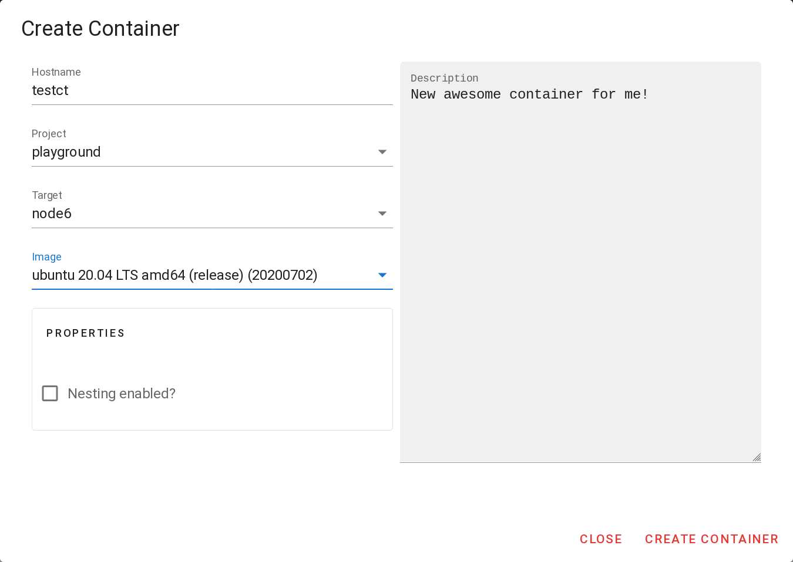
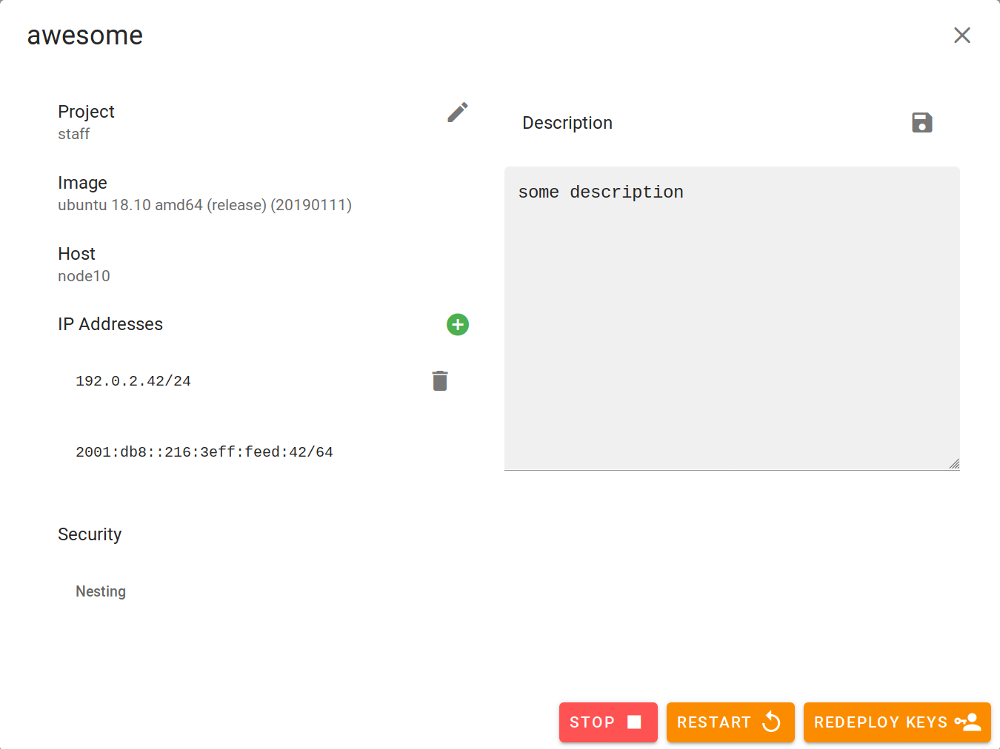

# Basic Container operations

The general creation and modification of containers is hopefully intuitive.
## List your containers

You get a list of all containers you have access to in a listing overview. You can search for arbitrary fields to limit the list.
Light gray IPs are either assigned, but not present on the container or present on the container without reservation in the dashboard. A restart resolves most non-malicious situations.

## Create a container
To create a new container, klick the green plus button on the bottom right. Please decide if you want to run another container solution such as docker inside the container. In this case, mark the Nesting checkbox.

After creation, the container is in a stopped state. Start the container and it will acquire an IP and deploy your Gitlab SSH keys to the default user. Soon the hostname of your container will be resolvable and you can connect to the new instance by e.g.

    ssh ubuntu@testct.cts.domain.tld
   

## Edit a container
All container can be edited by klicking on the green cog on the left of the name. This modal allows you then to change some parameters of the container and add or delete legacy IPs.

Adding or removing an IP requires either to restart the container or you have to add it manually inside the container. If the project changes of there the users of the project changed, you can redeploy keys to add the new keys to the container for ssh access. 
  
> ⚠️ **existing SSH keys will not be deleted**

>