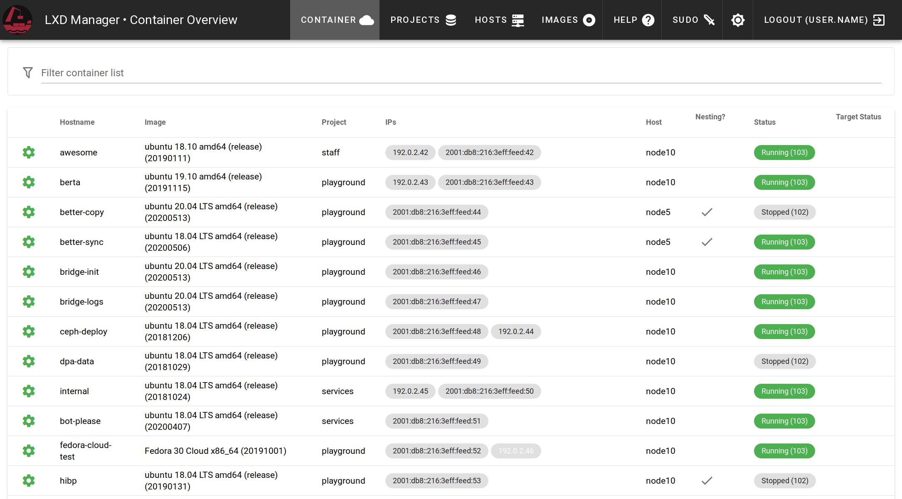

# LXD manager
The lxd-manager is a management software which is used to orchestrate multiple hosts of lxd containers with  specific deep integrations. It was built with very specific demands, but might be useful to someone else.

## Users
If you are a user and want basic overview how to interact with the manager, have a look at the [User Guide](overview.md) section

## Administrators

For guidance on installing lxd-manager on your infrastructure, have a look at the [installation section](install.md) 

## Background

We needed lightweight containers on different kinds of hosts, which behave like physical machines. Unfortunately with inhomogeneous hosts, the lxd built-in cluster is not reliable and we barely rely on cluster features, as most often we want full control over where a container is deployed.

On top, each container is attached to two network interfaces.

- eth0 is connected to a bridge of the host and gets an IPv4 NATed address
- eth1 is bridged directly to the hosts interface and obtains a SLAAC IPv6 address. If required, users can assign IPv4 addresses to this interface through our api.

The service contains an authoritative DNS server for all containers which are publicly reachable.

Another useful feature is the integration with gitlab. Oauth for user authentication and direct provisioning of ssh keys from the user's gitlab profile.

Unlike many lxd web UIs, this software uses its own database for persistance and has a background synchronisation service, as live polling of the lxd api is too slow. Actions are usually displayed responsive and then performed in a background task.